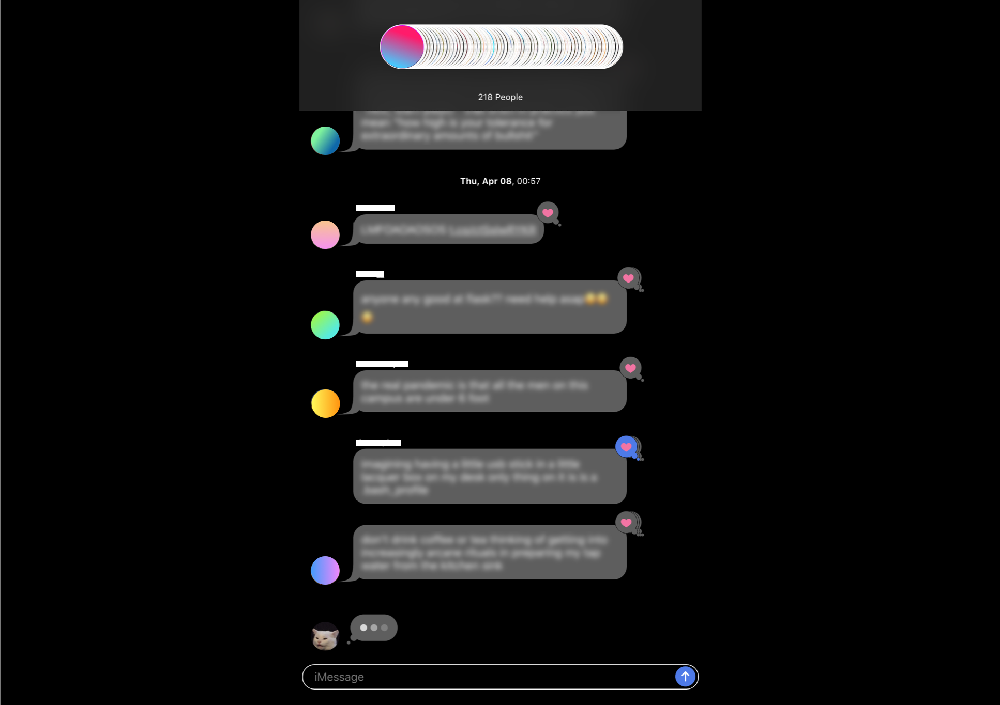

# iTwitter
### Express, React, Node, Twitter API
#### Currently not working because Heroku removed their free plan 😀 working on deploying it elsewhere!
Turn your Twitter timeline into an iMessage groupchat for max chaos. Enjoy!

Built with: Express, React, NodeJS

### Usage Notes & Caveats
- Timeline doesn't update automatically; infinite scroll is activated by scrolling downwards at the bottom of the feed
- There's a small lag between when likes & unlikes are registered by the Twitter api, so scrolling / refreshing immediately after liking / unliking may cause the app to display the false status for a liked / unliked Tweet
- No retweet functionality, no replies (might accidentally subtweet), no deleting Tweets
- Basically SMS, text-only
- Logout doesn't work as expected, must close entire browser session
- Will work on it more when I have time! But feel free to try / break / fix stuff & make a PR, some suggestions are below

### TODO
- Fix logout bug
- Item nesting in GrayMessage.js and BlueMessage.js and corresponding CSS in Message.css are quite messy, can be cleaned up
- Perhaps add retweet functionality later (retweet twice = no effect); see icons in "options-unused"
- Maybe add unfollowing functionality — "remove from groupchat" — but this might be weird because removing from groupchat is
  two-way, unfollowing isn't
  - Counterpoint: the app displays Tweets from followings, which are not necessarily two-way anyway
- Swipe left to see timestamps on messages (in general, better animations — perhaps using react-use-gesture and react-spring)
  - Another animation idea: tweeting / sending message: similar animation as when sending iMessage
  - Another animation idea: nonlinear - decrease speed over duration of single scroll
- Style scrollbar like iMessage's (thin & gray bar)
- Double-tap header to scroll to top
- Autosizing textarea should actually push the entire stream of Tweets upwards, not cover them)
- Add error-handling for liking / unliking / Tweeting
- Add functionality for deleting Tweets

### Acknowledgements
The following resources were really helpful in the development of this project!
- Tutorials:
    - [Deploying to Render](https://dev.to/gregpetropoulos/render-deployment-free-tier-of-mern-app-52mk) — don't know if this'll work yet haha
    - [Setup](https://www.freecodecamp.org/news/how-to-create-a-react-app-with-a-node-backend-the-complete-guide/)
    - [Twitter Login / Logout with Passport](https://medium.com/swlh/setting-up-twitter-oauth-with-node-and-passport-js-2298296b237c)
- Libraries / packages:
    - [twitter-api-client](https://www.npmjs.com/package/twitter-api-client)
    - [shuffle-array](https://www.npmjs.com/package/shuffle-array)
    - [autolinker](https://www.npmjs.com/package/autolinker)
    - [autosize](https://www.npmjs.com/package/autosize)
    - [react-scroll-to-bottom](https://www.npmjs.com/package/react-scroll-to-bottom)
    - [he](https://www.npmjs.com/package/he)
